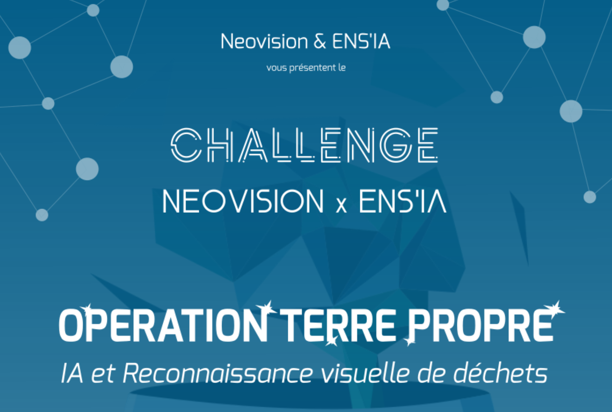

# Challenge Ens’IA 2022 x Neovision - 2ème édition !

_Lien d'inscription à la fin du post_

## C'est quoi ce challenge ?

Il s'agit d'un challenge d'intelligence artificielle organisé conjointement par [Neovision](https://neovision.fr) et [Ens'IA](https://github.com/YannSia/tutorials). Pour la deuxième édition de ce challenge, vous devrez créer une IA, mais pas de panique : des coachs de Neovision seront là pour vous accompagner, et des workshops vous donnerons des connaissances supplémentaires !

Ce challenge sera pour vous l'occasion de vivre un vrai projet IA et d'approfondir vos connaissances, mais aussi et surtout de vous amuser et de faire de belles rencontres ✨

L'année précédente, le challenge portait sur l'[OCR](https://en.wikipedia.org/wiki/Optical_character_recognition) et avait réuni plus de **30 participants** répartis en **12 équipes** qui se sont affrontées. Les meilleures équipes ont été récompensées de **6 cartes Nvidia Jetson**!

## L'édition 2022

🎯 Cette année encore, le but reste le même : entraîner le modèle qui fera le meilleur score sur le jeu de données que nous vous fournirons

### Le sujet 🤩

Nous avons choisi un sujet qui nous tient à coeur : **l'environnement** 🌍
Pour être plus précis, vôtre tâche sera de produire un modèle capable de **détecter** et **classifer** différents types de **déchets** sur des images.
Vous serez par **équipes de 1 à 3 maximum** !

Qui dit deuxième édition dit plus d'ambition, alors on vous gâte un peu plus sur les lots 😍 :

- 3 NVIDIA Jetson 4Go
- 3 NVIDIA Jetson 2Go
- 9 bons cadeaux LDLC (200/150/100€)
- 3 inscriptions [ECML PKDD](https://ecmlpkdd.org)
- 3 trophées
- Formations techniques Neovision
- Entretiens pour un stage chez Neovision

## Les dates à retenir :

Intéressé(s) ? Top 💯, alors notez bien ces dates :

- ✔️ 16 décembre : Annonce du challenge & conférence IA
- ✔️ **20 janvier de 17h à 19h** : Workshop traitement de données + découverte d'un outil développé par Neovision (Tadaviz)
- ✔️ 23 janvier : Clôture des candidatures
- ✔️ 25 janvier : Association équipe/coatch
- 1er février : Début du challenge et soirée de lancement
- 8 février : 1er coaching
- 15 février : 2e coaching
- 17 février : Workshop collaboratif
- 22 février : 3e coaching
- 27 février : Fin du challenge
- Date incertaine : Soirée de cloture et résultats & remise des récompenses

## Inscription

[JE M'INSCRIS 🔥](https://forms.gle/C34Jswo9hVNtaiJZ7)

